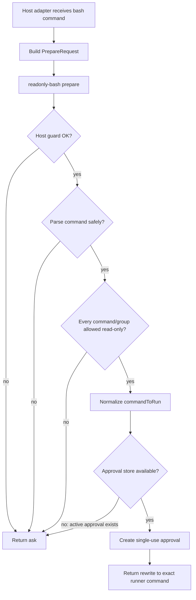
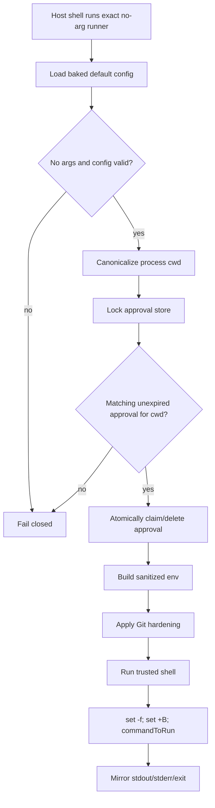
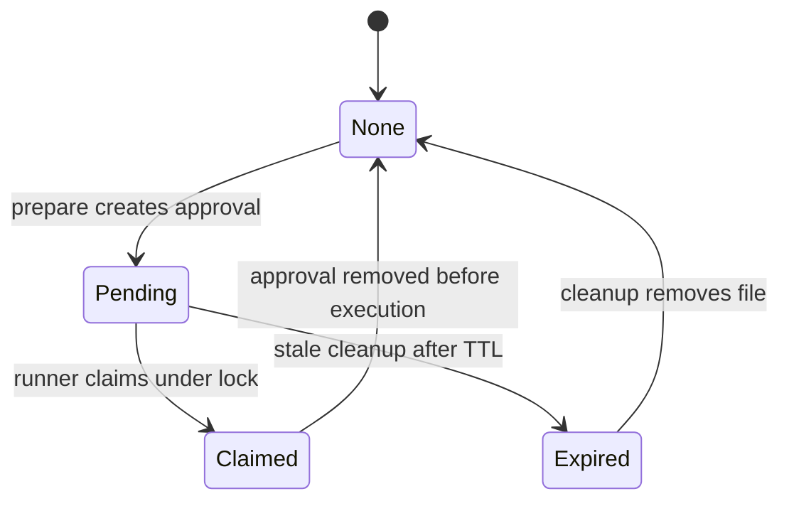
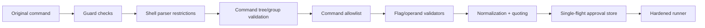

# readonly-bash architecture

## Goal

Approve only commands that are proven read-only, then execute the exact approved command through a hardened runner.

Everything else returns `ask` to the host harness.

## Core concepts

- **Host adapter**: harness-specific glue; passes `requestID`, `cwd`, `command`, runner path, config paths, and guard constraints.
- **Classifier**: parses one shell command string into a small command tree and returns `readonly` or `ask`.
- **Prepare**: classifier + guard checks + approval creation.
- **Approval store**: single-use, locked, cwd-bound approval files.
- **Runner**: no-arg binary mode that claims one approval and executes it under hardened env/shell rules.

## Prepare flow

## Classifier model

The classifier intentionally recognizes a small shell subset:

- Flat argv command segments connected by `&&`, `||`, `|`, `;`, or newlines.
- Complete parenthesized command groups whose contents recursively pass the same classifier.
- Only `/dev/null` stdout/stderr redirections, with or without spaces after `>`.
- Quoted glob patterns as data; unquoted globs, command substitution, backticks, arbitrary variables, process substitution, comments, backgrounding, and writes are rejected.
- Exact `$HOME` and `$HOME/...` path forms are normalized to literal absolute paths before rendering; other expansion syntax is rejected.

Read-only coverage is still allowlist-based. Git, `find`, and common agent exploration tools (`stat`, `readlink`, `realpath`, `tree`, `cut`, `tr`, `uniq`, `jq`, path predicates, etc.) each have bounded flag/operand validators. Mutating forms such as `git push`, `git checkout`, `git stash pop`, `find -delete`, `find -exec`, output-file flags, interpreters/eval, network tools, and package managers remain default-deny. Read-only means no mutation/execution/network by classifier policy; it is not a privacy boundary for readable files.

## Runner flow

## Approval lifecycle

## Decisions

- Default result is always `ask`.
- The runner is allowed by hosts as one exact no-arg command.
- No wildcard runner permission.
- Runner config is loaded from a baked default config path.
- `requestID` is diagnostic; runner matching is by locked approval + canonical cwd.
- Approval TTL is only crash cleanup, not concurrency.
- Unknown commands, flags, unsafe shell syntax, network tools, mutations, and parse failures are not approved.
- Allowlisted exploration commands are read-only by subcommand/flag/operand shape, not by command name alone.

## Safety gates

## Host responsibilities

- Call `prepare` before the host permission system.
- Rewrite only on `{ action: "rewrite" }`.
- Leave command unchanged on `{ action: "ask" }`, errors, invalid JSON, or timeout.
- Block direct runner invocation attempts before permission matching.
- Pass accurate guard constraints: shell path, shell prefix, dangerous env, trusted paths.

## Core responsibilities

- Never assume a specific host.
- Parse and classify commands deterministically.
- Create approvals atomically and with strict permissions.
- Canonicalize cwd before approval matching.
- Refuse concurrent unclaimed approvals.
- Sanitize env and enforce trusted shell/PATH at execution time.
