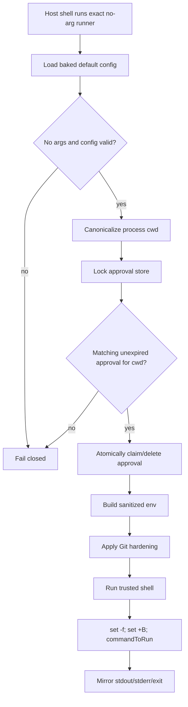
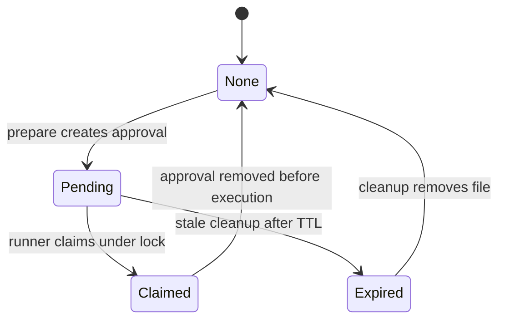

# readonly-bash architecture

## Goal

Approve only commands that are proven read-only, then execute the exact approved command through a hardened runner.

Everything else returns `ask` to the host harness.

## Core concepts

- **Host adapter**: harness-specific glue; passes `requestID`, `cwd`, `command`, runner path, config paths, and guard constraints.
- **Classifier**: parses one shell command string and returns `readonly` or `ask`.
- **Prepare**: classifier + guard checks + approval creation.
- **Approval store**: single-use, locked, cwd-bound approval files.
- **Runner**: no-arg binary mode that claims one approval and executes it under hardened env/shell rules.

## Prepare flow

## Runner flow

## Approval lifecycle

## Decisions

- Default result is always `ask`.
- The runner is allowed by hosts as one exact no-arg command.
- No wildcard runner permission.
- Runner config is loaded from a baked default config path.
- `requestID` is diagnostic; runner matching is by locked approval + canonical cwd.
- Approval TTL is only crash cleanup, not concurrency.
- Unknown commands, flags, shell syntax, network tools, mutations, and parse failures are not approved.

## Safety gates

## Host responsibilities

- Call `prepare` before the host permission system.
- Rewrite only on `{ action: "rewrite" }`.
- Leave command unchanged on `{ action: "ask" }`, errors, invalid JSON, or timeout.
- Block direct runner invocation attempts before permission matching.
- Pass accurate guard constraints: shell path, shell prefix, dangerous env, trusted paths.

## Core responsibilities

- Never assume a specific host.
- Parse and classify commands deterministically.
- Create approvals atomically and with strict permissions.
- Canonicalize cwd before approval matching.
- Refuse concurrent unclaimed approvals.
- Sanitize env and enforce trusted shell/PATH at execution time.
